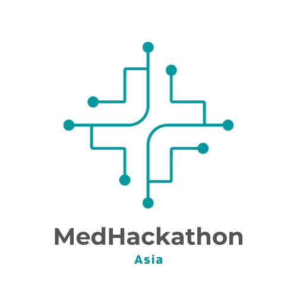

<!-- centering markdown images -->

  

# MedHackathon Asia 2025

## Background

The diversity in Asian genomic data holds immense potential to enhance our understanding of human genetics globally. However, there is currently a lack of communication and collaboration among national genome projects in various Asian countries. This fragmentation undermines the potential benefits that each country's unique efforts and resources can bring to the field of medical informatics. By fostering better communication and collaboration, we can raise the value and impact of individual national projects, ultimately contributing to a more comprehensive and inclusive understanding of human genetics.

## Objectives

The primary objective of the MedHackathon is to establish a robust networking platform for medical informatics researchers across Asia. By bringing together experts from diverse backgrounds, the event aims to foster collaboration and facilitate the exchange of knowledge and experiences. This collective effort is intended to build a cohesive community that respects and values the unique contributions of each country. Through enhanced networking, the event seeks to bridge the existing communication gaps and create a unified approach to advancing medical informatics research in the region.

## Expected outcomes

- Enhanced sharing of knowledge and experiences among medical informatics researchers in Asia.
- Formation of a diverse and inclusive community that respects each country's decisions and contributions.
- Improved communication and collaboration among national genome projects in Asian countries.
- Elevated value and impact of individual national efforts in medical informatics.
- Strengthened regional capacity to contribute to global human genetics research.

## Possible Hackathon Products

- A centralized data catalog for medical and genomic datasets from participating countries.
- A comprehensive report or database on privacy protection laws in each country.
- Standardized metadata templates for genomic and medical data.
- A reference panel for genomic data that can be used by researchers across Asia.
- Documentation and guidelines for best practices in medical informatics research.

## Key Dates

- November: registration opens
- End of December: registration closes

## Tentative Schedule

February 3-7, 2025

- Monday, 3rd
  - Morning: Gather at Bangkok, move to the Burapha University
    - The bus will depart from Suvarnabhumi Airport at 10:00 AM
  - Afternoon: Opening session
- Tuesday, 4th
  - Morning: Tutorial session
  - Afternoon: Hackathon
- Wednesday, 5th
  - Morning: Tutorial session
  - Afternoon: Hackathon
- Thursday, 6th
  - Morning: Tutorial session
  - Afternoon: Hackathon
- Friday, 7th
  - Morning: Wrap-up session
  - Afternoon: Move to Bangkok
    - The bus will depart from Burapha University at 12:00 PM (noon) and is expected to arrive at Suvarnabhumi Airport by approximately 1:30 PM.

## Venue and Accommodation

- [Burapha University](https://www.buu.ac.th/), Chon Buri District, Chon Buri 20131, Thailand
  - Hackathon venue
    - Faculty of Pharmaceutical Sciences ([map](https://maps.app.goo.gl/t2eSSBfQ2Jk7tLGFA))
  - Accommodation
    - BUU HOTEL ([map](https://maps.app.goo.gl/pGer7oh8WF2mjkdd9))

## Expected participants

This event is primarily aimed at researchers, data scientists, and professionals in the fields of human genetics and medical informatics across Asian communities. By focusing on the unique challenges and opportunities within the region, the MedHackathon seeks to bring together experts to collaborate, share knowledge, and contribute to advancing the field of medical informatics in Asia.

## Registration

Please register from [here](https://forms.gle/q2TYu5oh2ss72xh27). The registration will close at the end of December 2024. We will send a confirmation of your participation in early January 2025.

## Sponsor

We gratefully acknowledge the support of the [Health Intervention and Technology Assessment Program Foundation](https://www.hitap.net/en/) of Thailand, whose generous funding has made this event possible. Their contribution has been instrumental in covering the venue fee, welcome dinner, and lunch throughout the event.

## Organing committee

- Jakris Eu-ahsunthornwattana (Mahidol University, Thailand)
- Toyofumi Fujiwara (Database Center for Life Science, Japan)
- Tsuyoshi Hachiya (Genome Analytics Japan, Inc., Japan)
- Mayumi Kamada (Kitasato University, Japan)
- Toshiaki Katayama (Database Center for Life Science, Japan)
- Yosuke Kawai (National Center for Global Health and Medicine, Japan)
- Shuichi Kawashima (Database Center for Life Science, Japan)
- Mark Landry (World Health Organization, Thailand)
- Surakameth Mahasirimongkol (Thailand National Science and Technology Development Agency, Thailand)
- Pitiporn Noisagul (Chiang Mai University, Thailand)
- Soichi Ogishima (Tohoku University, Japan)
- Tazro Ohta (Chiba University, Japan)
- Wasin Poncheewin (National Center for Genetic Engineering and Biotechnology, Thailand)
- Surasak Sangkhathat (Prince of Songkla University, Thailand)
- Nuttinee Teerakulkittipong (Burapha University, Thailand)
- Licht Toyo-oka (Toyama University of International Studies, Japan)

## Contact

Please join our google group at [MedHackathon Asia](https://groups.google.com/u/4/g/medhackathon-asia) or email to [MedHackathon Asia 2025 organizers](mailto:admin-medhackathon-asia@googlegroups.com)

